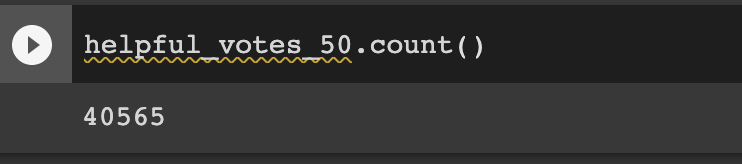
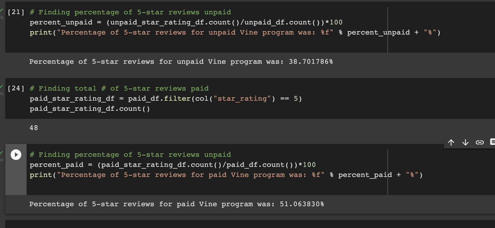

# Amazon Vine Analysis

## Purpose and Overview

The purpose of this analysis was to analyze Amazon reviews for various video games and see if there is a clear bias towards favorable reviews from Vine members in the dataset. To process such a large amount of information meant dealing with big data and as a result, many different services such as PySpark, Google Colab, pgAdmin, and Amazon Web Services were utilized for the job.

## Results

From the results of the analysis, we can see that there is a total of 1,785,997 reviews. However, we are only looking for reviews that contain 20 or more words since the rest are not useful. 

Out of all the results, we find that only about 65,379 had more than 20 words.

Narrowing the list further, helpful votes are those that are 50% or greater than the total votes. That narrows the list further down to 40,565.

Looking at these reviews, we can see that 94 are paid for the vine program and 40471 were unpaid.

• Filtering for 5-star reviews, the percentage of 5-star Vine reviews unpaid was 38.7%.
• The percentage of 5 star reviews that were paid was 51.06%.

## Summary

Althogether, the sample size was too small to reach an accurate conclusion about the data regarding the percentage of unpaid 5 star Vine reviews, we can see that there is a slight bias towards paid reviews.
